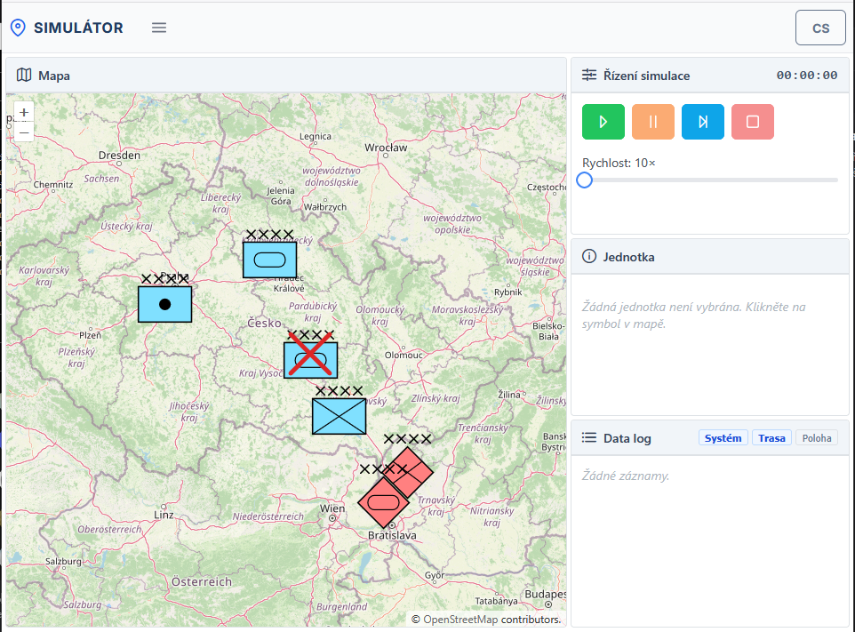

# Simulator

[](https://github.com/martinkobelka/simulator/actions/workflows/deploy.yml)

A military unit simulation tool with a React frontend and a Node.js WebSocket server.

**Live demo:** https://simulator.martinkobelka.cz



## Project Structure

```
simulator/
├── app/                        # React frontend (TypeScript)
│   ├── public/                 # Static assets (HTML, SVG symbols)
│   ├── src/
│   │   ├── components/         # UI components (map, panels, dialogs)
│   │   ├── data/               # Entity definitions and SIDC symbols
│   │   ├── locales/            # i18n translations (cs, en, sk)
│   │   ├── services/           # Map, WebSocket, UI services
│   │   └── store/              # Redux state management
│   └── package.json
└── server/                     # Node.js WebSocket server
    ├── SimulationEngine.js     # Core simulation logic
    ├── entities.js             # Entity definitions
    ├── broadcast.js            # WebSocket broadcasting
    ├── constants.js            # Configuration constants
    ├── logger.js               # Logging utilities
    ├── index.js                # Server entry point
    └── package.json
```

## Getting Started

### Prerequisites

- Node.js v18+

### 1. Start the server

```bash
cd server
npm install
npm start
```

The server runs on port **8999** by default. You can override it:

```bash
node index.js --port 9000
```

### 2. Start the frontend

```bash
cd app
npm install
npm start
```

The app opens at `http://localhost:3000` and connects to the WebSocket server automatically.

### 3. Build for production

```bash
cd app
npm run build
```

The production build is output to `app/build/`.
